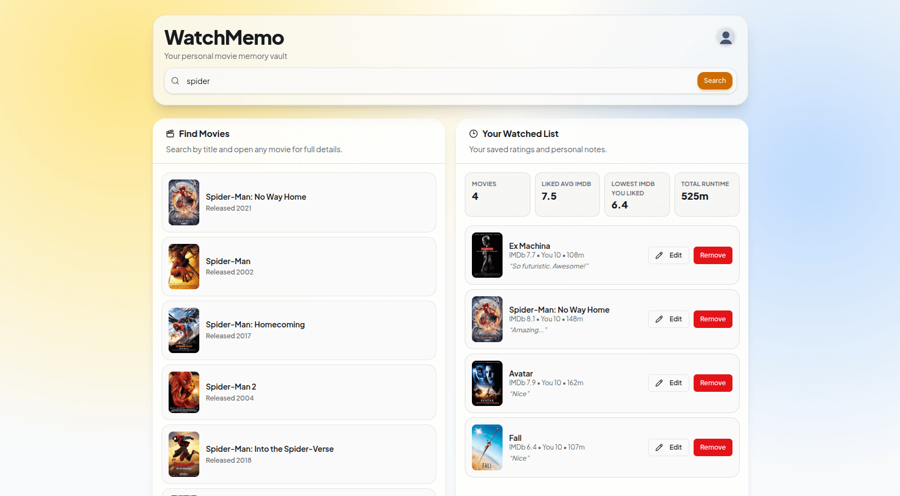

<div align="center">
  
  <p><strong>Your personal movie memory vault.</strong></p>
  <p>
    <a href="https://watchmemo.vercel.app" target="_blank" rel="noreferrer"><strong>Live App</strong></a>
  </p>
</div>



## Overview
WatchMemo is a movie tracking web app focused on personal context, not just lists.

You can discover movies publicly, and when you log in, you can keep a private watched history with ratings and personal notes.

## Current Features
- Public movie search (no login required)
- Supabase authentication (login, signup, password reset, password update)
- Profile settings (display name + password update)
- Save watched movies with rating and optional note
- Edit or remove watched entries anytime
- Optimistic UI updates for save/edit/delete actions
- Loading skeletons and responsive mobile/desktop layout
- Search with controlled debouncing + manual submit
- SEO setup with metadata, Open Graph, Twitter cards, sitemap, robots, and JSON-LD

## Tech Stack
- Next.js 15 (App Router)
- React 19 + TypeScript
- Tailwind CSS v4
- shadcn-style UI components
- Supabase (Auth + Postgres)
- OMDb API

## Environment Variables
```bash
OMDB_API_KEY=your_omdb_api_key_here
NEXT_PUBLIC_SITE_URL=https://watchmemo.vercel.app
NEXT_PUBLIC_SUPABASE_URL=https://your-project-ref.supabase.co
NEXT_PUBLIC_SUPABASE_ANON_KEY=your_supabase_anon_key
```

## Data Layer
Database schema and RLS policies:
- [`supabase/schema.sql`](./supabase/schema.sql)

Main table:
- `public.watched_movies`

Core columns used by the app:
- `user_id`
- `imdb_id`
- `user_rating`
- `comment`
- `movie_snapshot` (JSON snapshot for quick watched list rendering)
- `created_at`, `updated_at`

## Scripts
```bash
npm run dev
npm run lint
npm run build
npm run start
```

## Product Behavior
- Guests can browse and search freely.
- Login is only required for persistent actions (save/edit/delete watched data).
- User records are isolated through Supabase Row Level Security (RLS).

## Contributing
Useful contributions are welcome.

Open an issue or PR with:
- clear problem statement
- reasoning and expected behavior change
- screenshots/video for UI updates
- notes about edge cases or migration impact

Preference is given to product-level improvements over superficial refactors.

## Links
- Live: https://watchmemo.vercel.app
- GitHub: https://github.com/CodeWithAlamin
- X: https://x.com/CodeWithAlamin
- LinkedIn: https://linkedin.com/in/codewithalamin
